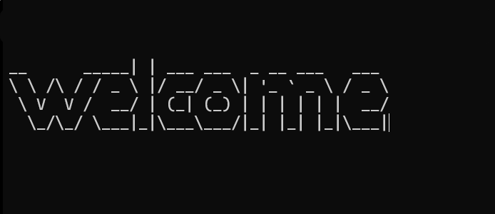

# 🎮 tictactoe-game


A Tic Tac Toe game that runs directly in the terminal, built with basic Python data structures — no external libraries.



---

## 🚀 How to run

Make sure you have Python installed, then run in your terminal:

```
py tictactoe.py
```

---

## 🕹️ How to play

When the game starts, you'll see the board with a number for each position:

```
[1] [2] [3]
[4] [5] [6]
[7] [8] [9]
```

Two players take turns — **X** and **O**. Each turn, type a number from 1 to 9 to place your mark on that position.

The first player to occupy 3 positions in a row — horizontally, vertically, or diagonally — wins. If the board fills up with no winner, it's a draw.

At the end of each match, you can choose to restart or quit.

---

## ✅ Features

- 🎨 ASCII art welcome screen
- 🚫 Input validation — blocks invalid or already occupied positions
- 🏆 Win and draw detection
- 🔄 Restart without closing the terminal

---

## 🛠️ Built with

- Python (no external libraries)